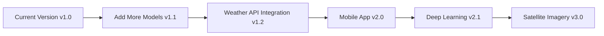

# 🌾 Crop Yield Prediction System

An advanced **Machine Learning-based Crop Yield Prediction System** with an interactive **Streamlit Dashboard** for predicting agricultural yields using environmental and temporal factors.


---

## 👨‍💻 Developer Information

**Developed By:** Shubhankar Khatik  
**Institution:** Institute of Engineering & Technology (IET), Lucknow  
**Project Type:** Machine Learning | Agricultural Technology  
**Year:** 2025

---

## 📋 Table of Contents

- [Overview](#-overview)
- [Features](#-features)
- [Technology Stack](#-technology-stack)
- [Dataset Information](#-dataset-information)
- [Installation](#-installation)
- [Usage](#-usage)
- [Project Structure](#-project-structure)
- [Model Details](#-model-details)
- [Screenshots](#-screenshots)
- [Future Enhancements](#-future-enhancements)
- [Contributing](#-contributing)
- [License](#-license)
- [Contact](#-contact)

---

## 🎯 Overview

The **Crop Yield Prediction System** leverages machine learning algorithms to predict crop yields based on various environmental and agricultural parameters. This project aims to assist farmers, agricultural researchers, and policymakers in making data-driven decisions to optimize crop production.

### Problem Statement
Accurate crop yield prediction is crucial for:
- **Food Security Planning**
- **Resource Optimization**
- **Risk Management**
- **Policy Making**
- **Market Forecasting**

### Solution
An AI-powered web application that provides:
- Real-time yield predictions
- Interactive data visualization
- Historical data analysis
- Multi-country and multi-crop support

---

## ✨ Features

### 🏠 Home Page
- Project overview and key features
- Quick statistics and metrics
- Visual feature cards
- Developer information

### 🔮 Prediction Module
- **Interactive Input Form** with dropdowns and numeric inputs
- **Real-time Predictions** using trained ML model
- **Historical Comparison** with past data
- **Performance Indicators** showing prediction vs. average
- **Input Summary** for review

### 📊 Data Explorer
- **Dataset Overview** with key statistics
- **Interactive Filters** for area, crop type, and year range
- **Data Preview** with pagination
- **Statistical Summary** of all features
- **Download Functionality** for filtered data

### 📈 Analytics Dashboard
- **Key Performance Indicators (KPIs)**
- **Interactive Visualizations**:
  - Yield distribution by country
  - Yield distribution by crop type
  - Yield trends over years
  - Correlation heatmaps
  - Scatter plot analysis
- **Distribution Charts** for rainfall, temperature, and pesticides

### ℹ️ About Section
- Project documentation
- Technology stack details
- Usage instructions
- Tips for best results

---

## 🛠️ Technology Stack

### Frontend
- **Streamlit** - Interactive web application framework
- **Plotly** - Advanced data visualizations
- **HTML/CSS** - Custom styling

### Backend & ML
- **Python 3.8+** - Core programming language
- **scikit-learn** - Machine learning library
- **Pandas** - Data manipulation and analysis
- **NumPy** - Numerical computations

### Model
- **Algorithm:** Decision Tree Regressor
- **Preprocessing:** Custom preprocessing pipeline
- **Model Persistence:** Pickle serialization

### Visualization
- **Plotly Express** - Interactive charts
- **Plotly Graph Objects** - Custom visualizations

---

## 📊 Dataset Information

### Source
- **Dataset:** `yield_df.csv`
- **Total Records:** 28,242
- **Features:** 7 columns
- **Time Range:** 1990 - 2013

### Features Description

| Feature | Description | Type | Unit |
|---------|-------------|------|------|
| **Area** | Country/Region name | Categorical | - |
| **Item** | Crop type (Wheat, Rice, Maize, etc.) | Categorical | - |
| **Year** | Year of cultivation | Numeric | Year |
| **hg/ha_yield** | Crop yield (Target variable) | Numeric | hg/ha |
| **average_rain_fall_mm_per_year** | Average annual rainfall | Numeric | mm/year |
| **pesticides_tonnes** | Pesticides used | Numeric | tonnes |
| **avg_temp** | Average temperature | Numeric | °C |

### Sample Data Coverage
- **Countries:** 100+ countries worldwide
- **Crop Types:** 10+ major crops (Wheat, Rice, Maize, Soybeans, Potatoes, etc.)
- **Years:** 23+ years of historical data

---

## 🚀 Installation

### Prerequisites
- Python 3.8 or higher
- pip (Python package manager)
- Git (optional, for cloning)

### Step 1: Clone the Repository
```bash
git clone https://github.com/yourusername/crop-yield-prediction.git
cd crop-yield-prediction
```

### Step 2: Create Virtual Environment (Recommended)
```bash
# Windows
python -m venv venv
venv\Scripts\activate

# Linux/Mac
python3 -m venv venv
source venv/bin/activate
```

### Step 3: Install Dependencies
```bash
pip install -r requirements.txt
```

### Step 4: Verify Installation
```bash
python --version  # Should be 3.8+
streamlit --version  # Should be installed
```

---

## 💻 Usage

### Running the Application

#### Method 1: Standard Run
```bash
streamlit run app.py
```

#### Method 2: Custom Port
```bash
streamlit run app.py --server.port 8502
```

#### Method 3: Headless Mode (for servers)
```bash
streamlit run app.py --server.headless true
```

### Accessing the Application
Once running, open your browser and navigate to:
```
http://localhost:8501
```

### Making Predictions

1. **Navigate to Prediction Page** (🔮 Prediction)
2. **Select Parameters:**
   - Area (Country/Region)
   - Item (Crop Type)
   - Year
   - Average Rainfall (mm/year)
   - Pesticides (tonnes)
   - Average Temperature (°C)
3. **Click "Predict Yield"**
4. **View Results:**
   - Predicted yield value
   - Historical comparison
   - Performance indicators
   - Input summary

### Exploring Data

1. **Go to Data Explorer** (📊 Data Explorer)
2. **Browse Dataset:**
   - View raw data
   - Check statistics
3. **Apply Filters:**
   - Select specific countries
   - Choose crop types
   - Set year range
4. **Download Filtered Data** for offline analysis

### Analyzing Trends

1. **Visit Analytics Page** (📈 Analytics)
2. **Review KPIs:**
   - Average yield
   - Maximum yield
   - Average rainfall
   - Average temperature
3. **Explore Visualizations:**
   - Distribution charts
   - Correlation matrices
   - Scatter plots
   - Time series trends

---

## 📁 Project Structure

```
crop-yield-prediction/
│
├── app.py                          # Main Streamlit application
├── requirements.txt                # Python dependencies
├── README.md                       # Project documentation
│
├── models/                         # Trained models directory
│   ├── dtr.pkl                     # Decision Tree Regressor model
│   └── preprocessor.pkl            # Data preprocessing pipeline
│
├── yield_df.csv                    # Dataset file
│
├── .streamlit/                     # Streamlit configuration (optional)
│   └── config.toml                 # Configuration settings
│
├── notebooks/                      # Jupyter notebooks (optional)
│   ├── EDA.ipynb                   # Exploratory Data Analysis
│   └── Model_Training.ipynb        # Model training notebook
│
└── static/                         # Static files (optional)
    ├── images/                     # Screenshots and images
    └── docs/                       # Additional documentation
```

---

## 🤖 Model Details

### Algorithm: Decision Tree Regressor

**Why Decision Tree?**
- Handles non-linear relationships
- Interpretable results
- No need for feature scaling
- Handles mixed data types
- Fast predictions

### Model Training Process

1. **Data Loading & Cleaning**
   - Load dataset from CSV
   - Handle missing values
   - Remove duplicates

2. **Feature Engineering**
   - Encode categorical variables (Area, Item)
   - Scale numerical features
   - Feature selection

3. **Model Training**
   - Split data: 80% training, 20% testing
   - Train Decision Tree Regressor
   - Hyperparameter tuning

4. **Model Evaluation**
   - Cross-validation
   - Performance metrics calculation
   - Feature importance analysis

5. **Model Serialization**
   - Save model as `dtr.pkl`
   - Save preprocessor as `preprocessor.pkl`

### Model Performance Metrics

| Metric | Description | Purpose |
|--------|-------------|---------|
| **RMSE** | Root Mean Squared Error | Measures prediction error magnitude |
| **MAE** | Mean Absolute Error | Average absolute difference |
| **R² Score** | Coefficient of Determination | Proportion of variance explained |
| **MSE** | Mean Squared Error | Average squared error |

### Preprocessing Pipeline

```python
# Categorical Encoding
- Label Encoding for Area and Item columns

# Numerical Scaling
- StandardScaler for numerical features

# Feature Order
Year → Rainfall → Pesticides → Temperature → Area → Item
```

---

## 📸 Screenshots

### Home Page

*Overview of the application with key features*

### Prediction Interface

*Interactive prediction form with real-time results*

### Data Explorer

*Explore and filter dataset interactively*

### Analytics Dashboard

*Comprehensive data visualizations and insights*

---

## 🔮 Future Enhancements

### Short-term Goals
- [ ] Add more ML models (Random Forest, XGBoost, Neural Networks)
- [ ] Implement model comparison feature
- [ ] Add confidence intervals for predictions
- [ ] Include weather forecast integration
- [ ] Add export prediction reports (PDF/Excel)

### Medium-term Goals
- [ ] Integrate real-time weather APIs
- [ ] Add user authentication system
- [ ] Implement prediction history tracking
- [ ] Create mobile-responsive design
- [ ] Add multilingual support

### Long-term Goals
- [ ] Deploy on cloud (AWS/Azure/GCP)
- [ ] Develop mobile application
- [ ] Implement deep learning models
- [ ] Add satellite imagery analysis
- [ ] Create recommendation system for farmers

---

## 🧪 Testing

### Running Tests
```bash
# Unit tests
python -m pytest tests/

# Coverage report
python -m pytest --cov=app tests/
```

### Manual Testing Checklist
- [ ] App loads without errors
- [ ] All pages accessible
- [ ] Prediction works with valid inputs
- [ ] Data explorer filters work correctly
- [ ] Visualizations render properly
- [ ] Download functionality works
- [ ] Responsive design on different screen sizes

---

## 🤝 Contributing

Contributions are welcome! Here's how you can help:

### How to Contribute

1. **Fork the Repository**
   ```bash
   git clone https://github.com/yourusername/crop-yield-prediction.git
   ```

2. **Create a Feature Branch**
   ```bash
   git checkout -b feature/AmazingFeature
   ```

3. **Commit Your Changes**
   ```bash
   git commit -m 'Add some AmazingFeature'
   ```

4. **Push to the Branch**
   ```bash
   git push origin feature/AmazingFeature
   ```

5. **Open a Pull Request**

### Contribution Guidelines
- Follow PEP 8 style guide for Python code
- Write clear commit messages
- Add comments for complex logic
- Update documentation for new features
- Test your changes before submitting

---

## 📜 License

This project is licensed under the **MIT License** - see the [LICENSE](LICENSE) file for details.

```
MIT License

Copyright (c) 2024 Shubhankar Khatik

Permission is hereby granted, free of charge, to any person obtaining a copy
of this software and associated documentation files (the "Software"), to deal
in the Software without restriction, including without limitation the rights
to use, copy, modify, merge, publish, distribute, sublicense, and/or sell
copies of the Software, and to permit persons to whom the Software is
furnished to do so, subject to the following conditions:

The above copyright notice and this permission notice shall be included in all
copies or substantial portions of the Software.
```

---

## 🙏 Acknowledgments

- **Institute of Engineering & Technology (IET), Lucknow** for academic support
- **Kaggle** for providing agricultural datasets
- **Streamlit Community** for excellent documentation
- **scikit-learn** for robust ML algorithms
- **Plotly** for interactive visualizations
- **Open Source Community** for various libraries and tools

---

## 📞 Contact

**Shubhankar Khatik**

- 🎓 Institute of Engineering & Technology (IET), Lucknow
- 📧 Email: shubhankar.khatik@example.com
- 💼 LinkedIn: [linkedin.com/in/shubhankar-khatik](https://linkedin.com/in/shubhankar-khatik)
- 🐱 GitHub: [github.com/shubhankar-khatik](https://github.com/shubhankar-khatik)
- 🌐 Portfolio: [your-portfolio-website.com](https://your-portfolio-website.com)

---

## 📊 Project Statistics


---

## 🌟 Star History

[](https://star-history.com/#yourusername/crop-yield-prediction&Date)

---

## 📈 Roadmap



---

## 💡 FAQ

### Q1: What is the accuracy of predictions?
**A:** The model's accuracy varies based on the data quality and features. Check the R² score in the Analytics section for current performance metrics.

### Q2: Can I use my own dataset?
**A:** Yes! Replace `yield_df.csv` with your dataset. Ensure it has the same column structure.

### Q3: How do I retrain the model?
**A:** Use the Jupyter notebooks in the `notebooks/` folder to retrain with new data.

### Q4: Does this work offline?
**A:** Yes, once installed, the app works completely offline (except for external icons/images).

### Q5: Can I deploy this online?
**A:** Absolutely! Deploy to Streamlit Cloud, Heroku, AWS, or any cloud platform. See deployment section below.

---

## 🚀 Deployment

### Deploy to Streamlit Cloud (Free)

1. Push your code to GitHub
2. Go to [share.streamlit.io](https://share.streamlit.io)
3. Connect your GitHub repository
4. Deploy!

### Deploy to Heroku

```bash
# Create Procfile
echo "web: streamlit run app.py --server.port=$PORT --server.headless=true" > Procfile

# Deploy
heroku create your-app-name
git push heroku main
```

### Deploy to AWS EC2

```bash
# SSH into EC2 instance
ssh -i your-key.pem ec2-user@your-instance-ip

# Install dependencies
sudo yum update -y
sudo yum install python3 -y
pip3 install -r requirements.txt

# Run with nohup
nohup streamlit run app.py --server.port 8501 &
```

---

## 📖 Additional Resources

- [Streamlit Documentation](https://docs.streamlit.io)
- [scikit-learn User Guide](https://scikit-learn.org/stable/user_guide.html)
- [Plotly Python Documentation](https://plotly.com/python/)
- [Pandas Documentation](https://pandas.pydata.org/docs/)
- [Agricultural Data Science Papers](https://scholar.google.com)

---

## 🎓 Learning Resources

If you're new to this project or want to learn more:

1. **Machine Learning Basics**
   - [Coursera: Machine Learning by Andrew Ng](https://www.coursera.org/learn/machine-learning)
   - [Fast.ai](https://www.fast.ai/)

2. **Streamlit Tutorials**
   - [Official Streamlit Tutorial](https://docs.streamlit.io/library/get-started)
   - [YouTube: Streamlit Crash Course](https://www.youtube.com/)

3. **Agricultural Data Science**
   - Research papers on crop yield prediction
   - FAO Agricultural Database

---

## ⚠️ Disclaimer

This project is for **educational and research purposes only**. Predictions should not be the sole basis for critical agricultural decisions. Always consult with agricultural experts and consider multiple factors before making farming decisions.

---

<div align="center">

### Made with ❤️ by Shubhankar Khatik

**🌾 Empowering Agriculture with AI 🌾**

[⬆ Back to Top](#-crop-yield-prediction-system)

---

**If you found this project helpful, please consider giving it a ⭐ star!**

</div>

---

**Last Updated:** November 2024  
**Version:** 1.0.0  
**Status:** Active Development

